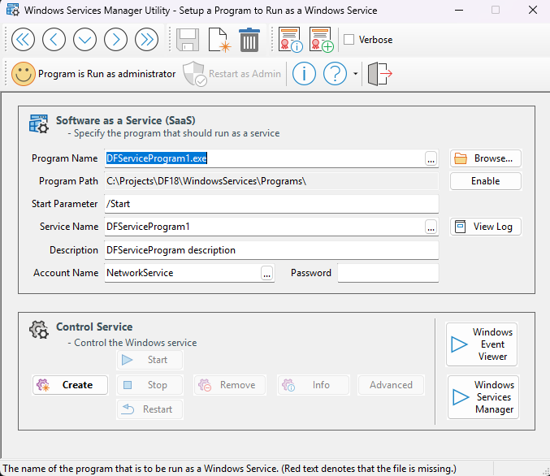

# The Windows Services Manager Utility

The **WindowsServiceUtil** program assists you in setting up any application to run as a Windows Service.

Internally, the program utilizes the **NSSM** command line utility to create and manage Windows Services. Unlike Microsoft's own tool, **srvany**, and other service helpers, NSSM effectively handles failures when running a service. It actively monitors the service and will restart it if it crashes, which is crucial for maintaining service availability.

Additionally, NSSM logs its progress in the Windows Event Log, allowing you to diagnose any issues that may arise with the application.

The workspace also includes a template, **DFServiceProgram1**, to help you build your own DataFlex program that can function as a Windows Service. This is beneficial for both Windows Desktop applications and WebApp applications.

