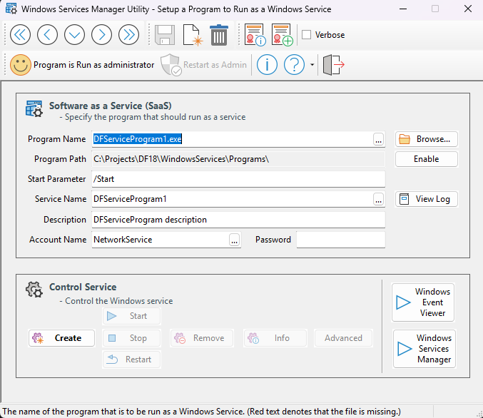

# The Windows Services Manager Utility
It is highly recommended to download and install the GitHub Desktop app, as it will significantly simplify your work. You can download it via this link: https://desktop.github.com/download/.

Once installed use the Edge browser, click the "<> Code" button at this GitHub page and select "Open with GitHub Desktop." This will install the complete repository in your chosen download location.

An alternate approach is to copy the address from the browser for the DFRefactor GitHub page, aka; https://github.com/NilsSve/DfRefactor

Then from GitHub Desktop, select "File - Clone a repostory", then select the third tab-page "URL", and paste the path from above. Finally select your local path to install to, and click the "Clone" button.

Note: Do not select "Download ZIP," as GitHub will not include the libraries used by the workspace, and you would need to download them manually, which can be cumbersome!
The **WindowsServiceUtil** program assists you in setting up any application to run as a Windows Service.

Internally, the program utilizes the **NSSM** command line utility to create and manage Windows Services. Unlike Microsoft's own tool, **srvany**, and other service helpers, NSSM effectively handles failures when running a service. It actively monitors the service and will restart it if it crashes, which is crucial for maintaining service availability.

Additionally, NSSM logs its progress in the Windows Event Log, allowing you to diagnose any issues that may arise with the application.

The workspace also includes a template, **DFServiceProgram1**, to help you build your own DataFlex program that can function as a Windows Service. This is beneficial for both Windows Desktop applications and WebApp applications.

