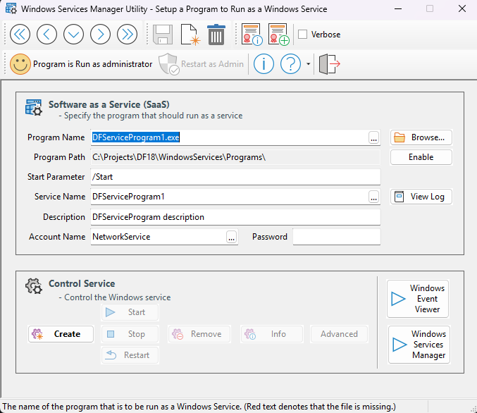

# The Windows Services Manager Utility

The **WindowsServiceUtil** program assists you in setting up any application to run as a Windows Service.

Internally, the program utilizes the **NSSM** command line utility to create and manage Windows Services. Unlike Microsoft's own tool, **srvany**, and other service helpers, NSSM effectively handles failures when running a service. It actively monitors the service and will restart it if it crashes, which is crucial for maintaining service availability.

Additionally, NSSM logs its progress in the Windows Event Log, allowing you to diagnose any issues that may arise with the application.

The workspace also includes a template, **DFServiceProgram1**, to help you build your own DataFlex program that can function as a Windows Service. This is beneficial for both Windows Desktop applications and WebApp applications.

## Setup after cloning

The libraries this workspace uses (DigitalCert, DFAbout, RDCToolsLib, vwin32fh) are **not** stored
in this repository (they are gitignored). Run **`setup.bat`** once from the repository root and it
provides them, behaving differently by machine so one arrangement serves both maintainer and user:

- On a machine with the shared RDC library pool next door (a sibling `..\Libraries` carrying the
  marker file `.rdc-library-pool`), it makes `Libraries\` a **junction** to that pool — one shared,
  editable copy of every library.
- Otherwise it **clones** the four libraries into this workspace's own `Libraries\` folder:
  isolated, self-contained, and it never writes anywhere outside this workspace.

It also runs `skip-local-data.cmd` so your local `Data\` database changes stay on your machine and
are never tracked or pushed. Either way `Libraries\` is local-only and never committed — re-run
`setup.bat` any time it looks missing or out of date. (Because `Libraries\` may be a junction, do
not run `git clean -x` here.)

The database tables ship directly in `Data\`, so the workspace runs out of the box after setup (`WinServiceData.zip` is just a spare copy of the same baseline).
